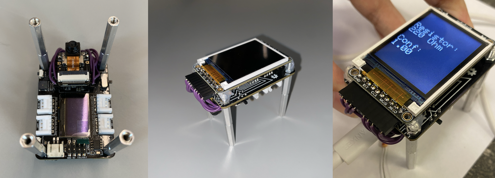
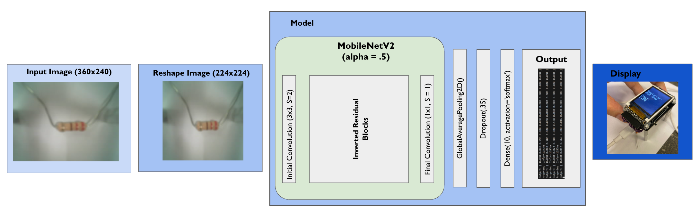
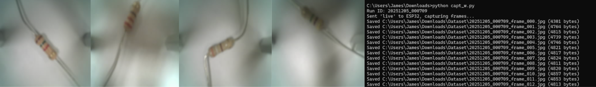
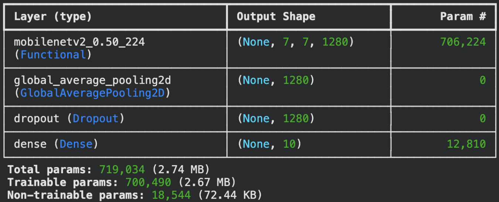
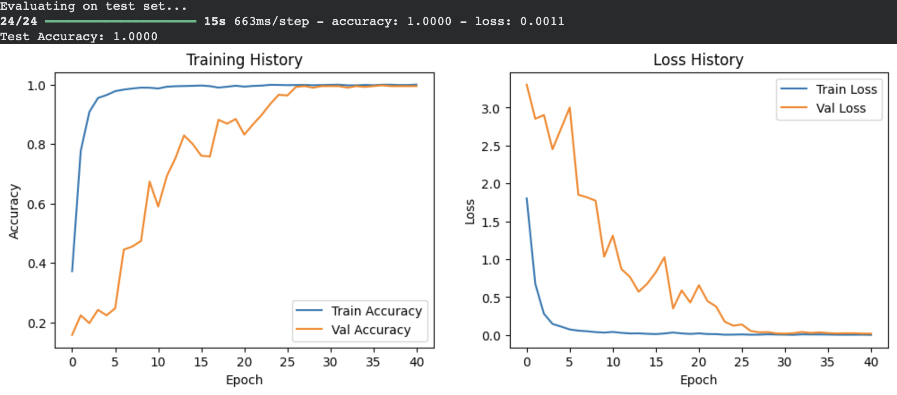
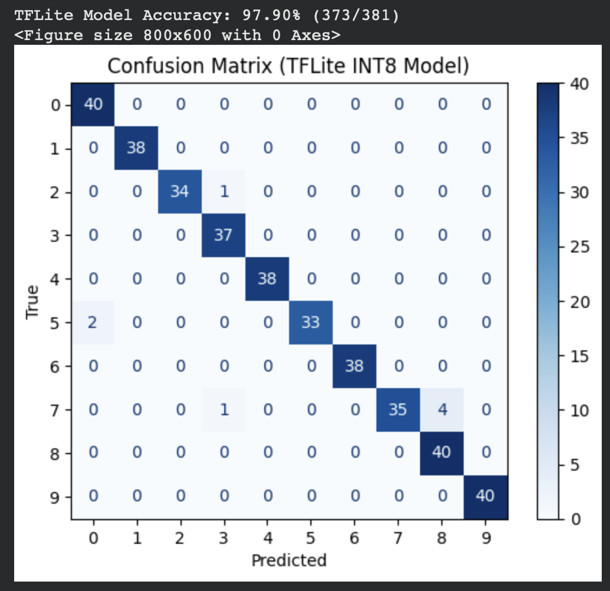

# Ohm Sweet Ohm: TinyML Resistor Classifier

An end-to-end TinyML edge vision system designed to automate resistor identification and sorting in electronics laboratories. Powered by an **XIAO ESP32S3 Sense**, **MobileNetV2 (α = 0.50)**, and **TFLite Micro**, the system performs real-time optical resistor classification directly on microcontrollers in **~1.2 seconds**, achieving an accuracy of **99.74%** across **10 classes**.

---

## Hardware Demonstration

> **Real-time inference running on Seeed XIAO ESP32S3 Sense (~1.2s latency, 99.74% accuracy):**

https://github.com/user-attachments/assets/1d65bf31-cd97-47a0-a1eb-eec64f69841b

*Captured live with top-mounted SPI display outputting predicted resistance class and model confidence score (video playback is sped up 3x).* 

---

## Problem & Context

Sorting loose 4-band resistors is notoriously tedious. Components frequently end up mixed in wrong bins or discarded. Misidentified resistors lead to circuit malfunctioning or board damage.

Standard computer vision solutions often rely on high-resolution cloud processing or object-detection bounding boxes, which are computationally prohibitive on low-power edge microcontrollers (and frankly overkill). **Ohm Sweet Ohm** addresses this challenge with a compact, standalone, and cost-effective hardware assembly running a custom image classification model tailored for hardware-constrained micro-cameras.

---

## Hardware Architecture & System Setup

| Component | Specification / Function |
| :--- | :--- |
| **Microcontroller & Camera** | Seeed Studio XIAO ESP32S3 Sense with OV3660 camera sensor |
| **Display** | Adafruit ST7735R 1.8" TFT SPI display (top-mounted for easy viewer visibility) |
| **Enclosure / Rig** | Custom standoffs calibrated to fix camera distance, enhancing inference consistency |
| **Firmware Stack** | C++ compiled via PlatformIO / VSCode, leveraging TFLite Micro C++ runtime |

### Physical Assembly
*Physical hardware rig featuring the Seeed XIAO ESP32S3 Sense, custom mounting standoffs, and top-mounted Adafruit SPI display.*

### System Block Diagram
*Hardware and data flow pipeline illustrating image acquisition, tensor normalization, on-chip INT8 TFLite Micro inference, and SPI display output.*

---

## Dataset Construction

Because deployable micro-cameras yield noisy, out-of-focus, or lower-quality images compared to high-end benchmark datasets, we collected a custom **3,765-image dataset** matching the exact deployment setup:

* **Capture Environment:** Captured using the native **OV3660** sensor at `FRAMESIZE_QVGA` ($320*240$), capturing identical focal distance, lighting, and shadow variations as inference time.
* **Class Breakdown:** 9 distinct resistor classes (including 10x multiplier pairs with 3 identical bands to test color granularity) plus 1 `Idle` (no resistor) state.
  * **Classes:** $47\Omega$, $220\Omega$, $390\Omega$, $1.5k\Omega$, $5.6k\Omega$, $6.8k\Omega$, $180k\Omega$, $560k\Omega$, $4.7M\Omega$
* **Data Augmentation & Diversity:** Automated script logged 100 images per run over Serial at 1s intervals across varying rotations, offsets, leg-bend configurations, and lighting setups.

---

## Model Architecture & Edge Optimization

Rather than using frozen transfer learning weights (which bottlenecked post-quantization accuracy to ~77%), the model features a full end-to-end retraining of MobileNetV2 feature extraction layers as the resistor dataset is highly domain-specific. The architecture is as follows:

1. **Feature Extractor:** MobileNetV2 with width multiplier **$ lpha = 0.50$** (Input: $224 	imes 224 	imes 3$).
2. **Pooling & Regularization:** Global Average Pooling 2D + $0.35$ Dropout rate.
3. **Classification Layer:** Single Dense layer outputting 10 logits.
4. **Quantization:** Full integer 8-bit (`INT8`) quantization for microcontroller RAM/Flash efficiency.

---

## Performance & Results

The finalized INT8 quantized model achieved **99.74% accuracy** on test datasets, demonstrating near-perfect class separation across identical-looking component packages.

  
  

---

## Authors & Acknowledgments

* **Timothy Zhang** & **James Steeman** – Developed for *ESE3600: Tiny Machine Learning*.